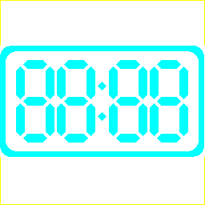

---
# 🎨 Icon Build Overview

Throughout this document, led7segment.txt is the text file input, led7segment.png is the image output from the translator, and led7segment_12_34.png is the post-processed image file to be used as the icon.  The translator, tst2png.py, is a Python script.

The icon is created by:

1.  Editing a text file (led7segment.txt) that will represent the icon
2.  Using a Python script, translating the text file to an image file (led7segment.png)
3.  Editing the image file to modify the colors of individual segments
    * See led7segment_12_34.png that shows a time of 12:34
4.  Using Lazarus, setting Project Options to load the led7segment_12_34.png file

---
# 🚀 Icon Build Instruction

**💡 Note:** Filenames are hard coded in the Python script.  Modify the script as necessary for other filenames.

1. With a text editor, edit led7segment.txt. Each character in the file represents a certain color of pixel.  Below is a table of allowed characters and their pixel translation:

   | Character    | Pixel       |
   |--------------|-------------|
   | \* asterisk  | cyan        |
   | +  plus sign | yellow      |
   |    blank     | transparent |

2. Run the Python script by double clicking on the run.bat file. The led7segment.png file will be created:

   

   **💡 Note:** The yellow border forces the image size to be 256x256
   
3. With an image editor, edit led7segment.png.  Color in segments as needed and save the file as led7segment_12_34.png

   

   **💡 Note:** The yellow border pixels were removed

4. In Lazarus load the led7segment_12_34.png file, for the Project Options.

   See the Build And Run section in [../readme.md](../readme.md)

## 📜 License

This project is released under the **MIT License**.  
You are free to use, modify, and distribute it.
