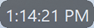

---
# ⏰ Top Clock  
A small, always-on-top digital clock written in Lazarus / Free Pascal.
Its minimal footprint keeps the current time visible at all times without getting in the way of your workflow.

---
## ⭐ Features

- Real‑time digital clock display  
- Minimal footprint
- Always on top
- Moveable to anywhere on screen
- Variable transparency

---
## 📸 Screenshot  



---
## 🛠️ How It Works

The clock uses:

- A `TTimer` component to call the Form's Paint method every second (to draw the time)
- Events to handle:
  - Dragging the clock around the screen
  - Displaying a help dialog
  - Closing the clock
  - Fading the background
- Properties to handle:
  - Removing border icons (BorderIcons := [];)
  - Removing captions (BorderStyle := bsNone;)
  - Keepiing form on top (FormStyle := fsSystemStayOnTop)

---
## 📂 Project Structure

```
/icon_build
  led7segment.png        – led7segment.txt translated output
  led7segment.txt        – ASCII drawing of seven-segment display
  led7segment_12_34.png  – led7segment.png post edited with 12:34 being displayed
  readme.md              – Instructions on how to build an icon file
  run.bat                – DOS batch file that runs text to .png translation
  txt2png.py             – Python text to .png translator
/top_clock
  top_clock.exe          – Courtesy, precompiled top clock
  top_clock.ico          – Icon file
  top_clock.lpi          – Lazarus Project Information file
  top_clock.lpr          – top clock program entry point
  unit_form_main.lfm     – Main form's Lazarus Form Metadata file
  unit_form_main.pas     – Main form's Pascal source
/.gitignore              – The .gitignore file
/LICENSE                 – MIT license file
/readme.md               – This file
/top_clock.png           – Screen capture of top_clock running
```

---
## 🚀 Getting Started

### Requirements
- **Lazarus IDE** (v4.4 or later) 
- **Free Pascal Compiler** (FPC 3.2.2 ro later)

### Build

1. Clone the repository:
   ```
   git clone https://github.com/MisterFussy/top_clock.git
   ```
2. Open the project in Lazarus:
   ```
   top_clock.lpi
   ```
3. Add the icon file:
   
   See the /icon_build/readme.md file for how to create the icon

   ```
   Shift+Ctrl+F11        – Project Options
   Load Icon             – Opens navigation window
   /icon_build           – Location of PNG used for icon
   led7segment_12_34.png – Opens colored version of translated .txt file
   OK                    – Accept project options
   ```

4. Press **Run** (F9)
   ```
   The clock window should appear immediately in the upper-left hand corner
   ```

### Run Operation

Once the clock appears, initialy in the upper left hand corner of the screen, you can perform the following actions:

1. Drag and drop the clock around your screen
   - Press the left mouse button, and hold down while dragging
2. Change the transparency of the clock (fading)
   - Hold the Shift key while pressig the left mouse button, and dragging left or right
   - It my be necessary to resize the clock to be big first, if the fading does not work
3. Bring up menu
   - Right click to bring up a menu
4. Close
   - Double click on the clock to quit

---
## 🧪 Future Enhancements

- Custom colors
- Alarm system  
- Hourly chime  

---
## 🤝 Contributing

Pull requests are welcome.  

---

## 📜 License

This project is released under the **MIT License**.  
You are free to use, modify, and distribute it.
