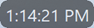

---
# ⏰ Top Clock  
A small, always-on-top digital clock written in Lazarus / Free Pascal.
Its minimal footprint keeps the current time visible at all times without getting in the way of your workflow.

---
## ⭐ Features

- Real‑time digital clock display  
- Minimal footprint (variable size - can be big)
- Always on top
- Moveable to anywhere on screen
- Variable transparency
- Temporary hiding if obscuring a window or control
- Stopwatch mode

---
## 📸 Screenshot  



---
## 🛠️ How It Works

The clock uses:

- A `TTimer` component to call the Form's Paint method every second (to draw the time)
- Events to handle:
  - Dragging the clock around the screen
  - Resizing the clock
  - Fading the clock in and out
  - Hiding the clock, and making it reappear
  - Displaying dialogs (instructions, options, about)
  - Closing the clock
  - Moving and enabling controls (start, pause, etc)
- Main form's properties to handle:
  - Removing border icons (BorderIcons := [])
  - Removing captions (BorderStyle := bsNone)
  - Keeping form on top (FormStyle := fsSystemStayOnTop)
  - Painting the client area

---
## 📂 Project Structure

```
/icon_build
  led7segment.png        – led7segment.txt translated output
  led7segment.txt        – ASCII drawing of seven-segment display
  led7segment_12_34.png  – led7segment.png post edited with 12:34 being displayed
  readme.md              – Instructions on how to build an icon file
  run.bat                – DOS batch file that runs text to .png translation
  txt2png.py             – Python text to .png translator
/top_clock
  top_clock.exe              – Courtesy, precompiled top clock
  top_clock.ico              – Icon file
  top_clock.lpi              – Lazarus Project Information file
  top_clock.lpr              – top clock program entry point
  unit_form_about.lfm        – About dialog box's Lazarus Form Metadata file
  unit_form_about.pas        – About dialog box's Pascal source
  unit_form_instructions.lfm – Instruction dialog box's Lazarus Form Metadata file
  unit_form_instructions.pas – Instruction dialog box's Pascal source
  unit_form_main.lfm         – Main form's Lazarus Form Metadata file
  unit_form_main.pas         – Main form's Pascal source
  unit_form_options.lfm      – Options dialog box's Lazarus Form Metadata file
  unit_form_options.pas      – Options dialog box's Pascal source
  unit_form_placer.pas       – Form placer (non-GUI) Pascal source
  unit_options.pas           – Options common variables (non-GUI) Pascal source
/.gitignore                  – The .gitignore file
/LICENSE                     – MIT license file
/readme.md                   – This file
/top_clock.png               – Screen capture of top_clock running
```

---
## 🚀 Getting Started

### Requirements
- **Lazarus IDE** (v4.4 or later) 
- **Free Pascal Compiler** (FPC 3.2.2 or later)

### Build

1. Clone the repository:
   ```
   git clone https://github.com/MisterFussy/top_clock.git
   ```
2. Open the project in Lazarus:
   ```
   top_clock.lpi
   ```
3. Press **Run** (F9)
   ```
   The clock window should appear immediately in the upper-left hand corner
   ```

### Run Operation

Once the clock appears, initialy in the upper left hand corner of the screen, you can perform the following actions:

1. Drag and drop the clock around your screen
   - Press the left mouse button, and hold down while dragging
2. Change the transparency of the clock (fading)
   - Scroll the mouse wheel up and down to fade the application in and out
3. Change the size of the clock
   - Move mouse near an edge, and left mouse down and drag
4. Bring up menu
   - Right click to bring up a menu
5. Temporarily hide clock
   - Hold Shift and click left mouse button
6. Close
   - Double click left on the clock to quit
7. Switch to an operate the stopwatch
   - Right click to bring up a menu
   - Select Options ...
   - Select Stopwatch for Run Mode
   - To start the stopwatch, click on the start button
   - To pause the stopwatch, click on the pause button
   - To continue timing when paused, click on the start button
   - To reset the time, lick on the reset button

---
## 🧪 Future Enhancements

- Alarm system  
- Hourly chime  

---
## 🤝 Contributing

Pull requests are welcome.  

---

## 📜 License

This project is released under the **MIT License**.  
You are free to use, modify, and distribute it.
